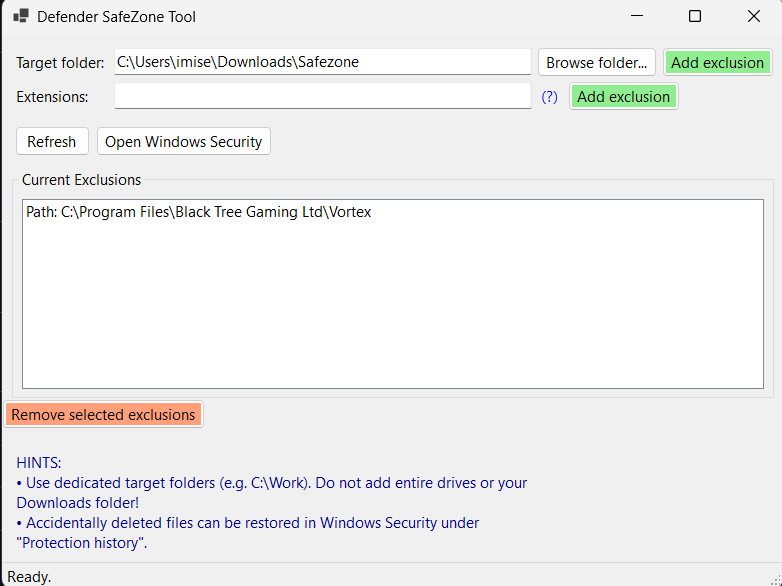

# 
 Defender SafeZone Tool

  

---

## Overview

  

Sometimes, Windows Defender stops you from opening folders or files that you know are completely safe (like a game mod or your coding folder). 

Normally, to tell Windows Defender to ignore them, you have to click through many confusing computer menus. 

This tool makes it super simple:
* **Folders:** Choose a folder, click one button, and Windows Defender will leave it alone.
* **File types:** Enter a file ending (like `.exe` or `.dll`), and Windows Defender will ignore those files everywhere.
* **Simple list:** View everything Windows Defender is ignoring in one clean list, and remove them with one click.

---

## How to Use

1. Open the tool.
2. Choose the folder you want to allow, or type in a file ending.
3. Click **Add exclusion**.

*Note: You must run the application as an Administrator so it has permission to change Windows Defender settings.*

---

## Installation

1. [**Download the Installer (.exe)**](https://github.com/Thatseasy/defender-safe-zone/releases/latest/download/DefenderSafeZoneTool_Setup.exe) (or get the latest version from the [Releases](https://github.com/Thatseasy/defender-safe-zone/releases) page).
2. Run the downloaded installer.
3. Launch the application from your desktop!

---

## Authors

Created by [@Thatseasy](https://github.com/Thatseasy).

---

## Feedback and Contributing

If you find a bug or want to suggest an improvement, please open an issue or start a thread in the [Discussions](https://github.com/Thatseasy/defender-safe-zone/discussions) tab.
